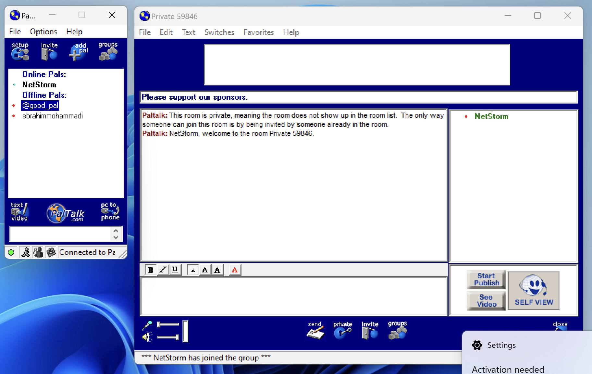

# Paltalk Server
This is a recreation of the Patalk server from around 2002 using version 5.0 of the Paltalk client. Created in Node.js

## Resources
Below are a list of resources that were useful in getting the Paltak server recreated.

### External links

[Paltalk.fun](https://paltalk.fun/) This projects main home. Visit here for the latest news and updates regarding this project.

[Paltalk Wikidot](http://paltalk.wikidot.com/introduction) Extremely useful information regarding packets and other tools that were instrumental in getting this up and running

[Olly Dbg](http://www.ollydbg.de/) Tool used to reverse engineer the Paltalk Client

[Wireshark](http://www.wireshark.org/) Used for discecting the pcp file

[WWPack32](https://www.wwpack32.venti.pl/wwpack32_download.html) Used to unpack the original 
Paltalk client

[Resource Hacker](https://www.angusj.com/resourcehacker/) Used to change some strings within the client

[Wayback Machine](https://web.archive.org/) Used to view websites as they were in 2002 and helpful in downloading old tools required to make this work

### Downloads
[Wireshark PCAP](./resources/paltalk-secured.pcap.pcapng)

