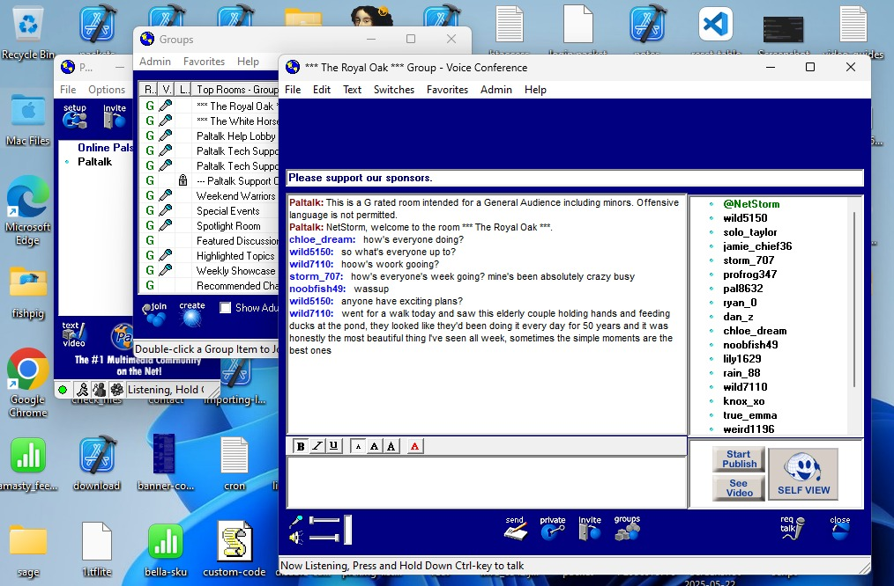

# Paltalk Chat Server

A modern Node.js-based Paltalk chat server with media support, supporting both text and voice chat rooms.

## Features

- **Chat Server**: Full Paltalk protocol support for text messaging
- **Media Server**: Voice chat support (video support planned for future)
- **SQLite Database**: Easy setup with no external database requirements
- **Room Management**: Support for permanent and temporary rooms

## Current Status

✅ **Most features are working including VOICE!** This server successfully recreates the core Paltalk experience with full text chat and voice communication support.

🚧 **Known Limitations:**
- **Authentication**: Password verification is not yet implemented (any password will work for login)
- **Web Cams**: Video/webcam functionality is not yet implemented (would love some help on this)

The server is fully functional for text and voice chat, making it an excellent recreation of the classic Paltalk experience from the early 2000s.

## Quick Setup

### Prerequisites

- **Node.js 16+** installed ([Download here](https://nodejs.org/))
- **Git** installed ([Download here](https://git-scm.com/))

### Complete Installation Steps

1. **Clone the repository:**
   ```bash
   git clone <repository-url>
   cd serv
   ```

2. **Install dependencies:**
   ```bash
   npm install
   ```

3. **Configure the server (optional):**
   ```bash
   cp .env.example .env
   # Edit .env file with your preferred settings
   ```

4. **Set up the database:**
   ```bash
   npm run setup
   ```
   This creates `database.sqlite` with:
   - 3 default users (including admin accounts)
   - 29 room categories
   - 314 pre-configured rooms
   - Sample data for testing

5. **Start the server:**
   ```bash
   npm start
   ```

### Server Status

Once started, you'll see:
```
✅ Paltalk Server started successfully
💬 Chat Server: Port 5001
🎙️ Media Server: Port 2090
```

The server is now ready for Paltalk client connections!

### Configuration Options

Copy `.env.example` to `.env` and customize as needed:

```bash
# Server Configuration
SERVER_IP=0.0.0.0              # Server bind address
SERVER_PORT=5001               # Chat server port
VOICE_SERVER_IP=127.0.0.1      # Media server IP
VOICE_PORT=2090                # Media server port

# Database Configuration
DB_PATH=./database.sqlite       # SQLite database file path

# Logging Configuration
LOG_LEVEL=info                 # Logging level (debug, info, warn, error)
LOG_FILE=./logs/server.log     # Log file path

# Environment
NODE_ENV=development           # Environment mode
```

### Database

The server uses SQLite for easy setup and portability. The database file (`database.sqlite`) is created automatically when you run `npm run setup`.

The database includes:
- **Users**: User accounts with authentication
- **Rooms**: Chat rooms with categories
- **Messages**: Offline message storage
- **Categories**: Room categories for organization
- **Logs**: Bounce and notification logs

### Default Rooms

The server comes with pre-configured rooms that were restored from the original Paltalk packets:
- **Paltalk Help Rooms**: Support and help channels
- **Social Rooms**: General chat and socializing
- **Language Rooms**: Rooms by language and region
- **Topic Rooms**: Specialized discussion rooms
- **Voice Rooms**: Voice chat enabled rooms

### Default Users

The setup creates default users:
- **NetStorm**: Default user account
- **Medianoche (co-admin)**: Co-admin
- **Dan**: Administrator

## Connecting with Paltalk Client

### Client Setup

1. **Download Paltalk 5.x client** (older versions work with this server)
2. **Configure client to connect to your server:**
   - Use a hex editor to change the server IP in the client
   - Or change the host ip in the Paltalk registry, however, this does seem to change back quite often.
3. **Default login credentials:**
   - **Username**: `NetStorm`
   - **Password**: `h2kclan` (or any password - authentication is is not yet implemented)

## Development``

### Available Scripts

- `npm start` - Start the server
- `npm run setup` - Initialize the database
- `npm run dev` - Start in development mode

### Troubleshooting

**Database issues:**
- Delete `database.sqlite` and run `npm run setup` again
- Check file permissions on the database file

**Connection issues:**
- Verify ports 5001 and 2090 are not in use
- Check firewall settings
- Ensure Node.js has network permissions

### File Structure

```
src/
├── server.js                    # Main server entry point
├── config/
│   └── constants.js            # Server configuration constants
├── core/                       # Core server components
│   ├── adminCommandSystem.js   # Admin command handling
│   ├── botManager.js           # Bot management system
│   ├── packetProcessor.js      # Packet processing logic
│   └── serverState.js          # Server state management
├── database/                   # Database managers
│   ├── databaseManager.js      # SQLite database operations
│   └── mysqlDatabaseManager.js # MySQL database operations (legacy)
├── models/                     # Data models
│   ├── Room.js                 # Room management
│   └── User.js                 # User management
├── network/                    # Network packet handling
│   └── packetSender.js         # Packet transmission
├── utils/                      # Utility functions
│   └── logger.js               # Logging utilities
└── voice/                      # Media server
    └── mediaServer.js          # Voice/video server (renamed from voiceServer)
setup/
├── sqlite-database.js          # SQLite database setup
```

### Resources

#### External links

[Paltalk.fun](https://paltalk.fun/) This projects main home. Visit here for the latest news and updates regarding this project.

[Paltalk Wikidot](http://paltalk.wikidot.com/introduction) Extremely useful information regarding packets and other tools that were instrumental in getting this up and running

[Olly Dbg](http://www.ollydbg.de/) Tool used to reverse engineer the Paltalk Client

[Wireshark](http://www.wireshark.org/) Used for dissecting the pcap file

[WWPack32](https://www.wwpack32.venti.pl/wwpack32_download.html) Used to unpack the original Paltalk client

[HxD Hex Editor](https://mh-nexus.de/en/hxd/) Recommended for changing the server IP address within the Paltalk Client

[Resource Hacker](https://www.angusj.com/resourcehacker/) Used to change some strings within the client

[Wayback Machine](https://web.archive.org/) Used to view websites as they were in 2002 and helpful in downloading old tools required to make this work

#### Downloads

[Uncompressed version of Paltalk 5.0](./resources/Paltalk.zip)

[Wireshark PCAP](./resources/paltalk-secured.pcap.pcapng)

[Gaim Plugin](./resources/gaim-pt.tar.gz) A Paltalk plugin for Gaim, this has been fundamental in getting the server up and running.



### Support

For support and issues, please refer to the project documentation or create an issue in the repository.

### License

This project is licensed under the ISC License.